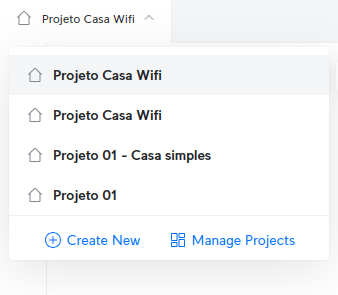

# Projeto Casa Wifi

## Tarefa 1: Projeto no UniFi Design Center
1. Baixe a [planta baixa](https://github.com/info-ifc-vda/tecinf_redes/blob/main/imagens/planta_casa02.jpg) que será a base do seu projeto.
2. Acesse o [UniFi Design Center](https://design.ui.com/)
   - Crie um novo projeto usando o botão **Create New**

   - Crie um novo projeto:**Create New Project**
       - Coloque o nome **Projeto Wifi**
       - Building type: **Home**
   - Anexe a planta baixa que você baixou
   - Ajuste a escala **Set Scale** conforme informações da professora
   - Desenhe as paredes:
       - As paredes externas devem ser de tijolo
       - As paredes internas devem ser de drywall
       - Coloque vidro nas janelas e nas portas de vidro
       - Coloque madeira nas portas internas
       - Coloque metal nos portões
       - Desenhe os móveis altos com madeira
   - Adicione os equipamentos de rede
       - Você deve incluir pelo menos um roteador (Devices -> CLoud Gateway), pois esse é o equipamento que conecta a sua casa ao Provedor de Serviços. Procure por um roteador doméstico
       - Se necessário, adicione Pontos de Acesso (APs): Devices -> Wifi. Procure por APs domésticos
   - Posicione os equipamentos de modo que a casa obtenha boa conectividade tanto em 2.4GHz quanto em 5GHz.
   - Exporte o projeto como **PDF**
       - Inclua no seu PDF:
           - Equipment List
           - Topology
           - Floor Plans
           - Wifi Coverage
   3. Poste sua atividade avaliativa no [github: https://classroom.github.com/a/l84Kzo35](https://classroom.github.com/a/l84Kzo35)

## Tarefa 2: Pesquisa de características e preços
1. Para cada um dos equipamentos incluídos no seu projeto pesquise:
- Área de cobertura
- Uplink (somente para roteadores)
- Montagem (teto ou parede)
- Taxa máxima de dados
- Ganho de antena
- Potência de transmissão máxima
- Recursos adicionais
- Tecnologias suportadas: informe quais tecnologias 802.11 o equipamento suporta e quais das tecnologias 2.4GHz, 5GHz e 6GHz o equipamento suporta
- Preço

2. Coloque as informações no README.md do github. Você pode escrever nesse arquivo usando tags html ou markdown. Markdown é mais fácil e você pode encontrar informações [aqui](https://www.markdownguide.org/basic-syntax/)
   - Para facilitar, utilize o [template](template.md) disponibilizado pela professora

## Tarefa 3: Projeto no Packet Tracer
1. Baixe o [arquivo base](https://github.com/info-ifc-vda/tecinf_redes/blob/main/atividades/projeto_wifi_casa/projeto_wifi.pkt) do projeto.
2. Abra o projeto e vá no modo físico.
3. Posicione o roteador sem fio e o ponto de acesso na mesma localização do projeto criado no UniFi Design Center. Se for necessário adicionar novos pontos de acesso, você pode copiar e colar o dispositivo já existente no projeto
4. No modo Lógico, conecte o **Roteador** ao **Roteador Wireless**
  - Use o cabo Direto (Copper Straight Trhough)
  - No Roteador, conecte o cabo à porta GigabitEthernet0/0
  - No Roteador Wireless, conecte o cabo à porta Internet
5. Conecte o **Roteador sem fio** aos Pontos de Acesso.
  - No Roteador sem fio, escolha uma porta GigabitEthernet
  - No Ponto de Acesso, conecte à porta Port 0
6. Abra o **Roteador sem fio** e configure com as seguintes informações:
  - Clique em **Wireless -> Basic Wireless Settings** e configure os seguintes itens:
     - 2.4 GHz:
       - SSID: CasaConectada
       - Canal: 6
       - Largura de Banda: 20MHz
      - 5GHz:
        - SSIG: CasaConectada5G
        - Canal: 149
        - Largura de Banda: 40MHz
  - Salve as configurações
  - Clique em **Wireless -> Wireless Security** e configure com as seguintes informações:
     - 2.4GHz e 5GHz:
        - Security Mode: WPA2 Personal
        - Encryption: AES
        - Password: (defina uma senha)
  - Salve as configurações e feche a tela.
7. Configure os Pontos de Acesso
  - Abra o Ponto de acesso e clique na aba **Config**
  - Procure a **Port 1** e configure com as seguintes informações:
     - SSID: APCasa Conectada
     - Canais:
       - 2.4GHz: 11
       - 5GHz: 36
     - Autentication:
       - WPAs-PSK
       - Defina uma senha
   - Não precisa salvar as configurações, pois o dispositivo já salva automaticamente.

**Obs:** Caso você tenha mais de um AP, configure-os com informações similares às do primeiro AP.
8. Adicione um Notebook e um celular e um tablet.
  - No modo físico, posicione os dipositivos em um local adequado.
  - Troque a placa de rede do notebook para que ele possa se conectar à rede sem fio
  - Conecte o notebook à rede sem fio mais próxima.
  - Conecte o celular e o tablet à rede sem fio mais próxima.
    - Para conectar, clique na aba **Config** e procure a interface **Wireless0**
    - Configure o SSID da rede à qual você pretende conectar o dispositivo e informe a senha.
9. Salve o seu projeto
10. Poste a atividade no [github: https://classroom.github.com/a/l84Kzo35](https://classroom.github.com/a/l84Kzo35)
  
